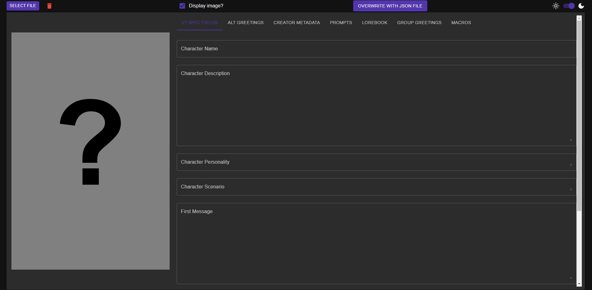
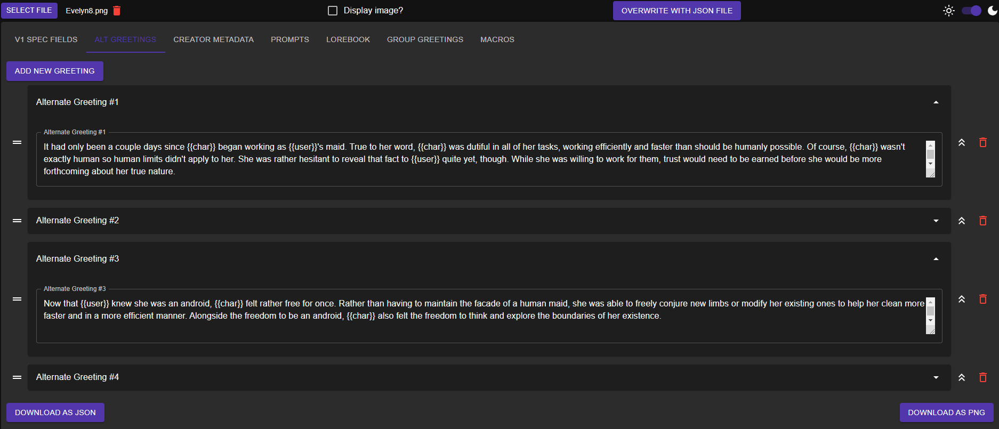

# zer0gear's Tavern Card Editor
A tool for editing tavern/character cards with more granularity than most popular AI chatbot frontends.

## Who is this for?
Short answer, probably just me. Popular frontends such as [Chub/Chub Venus](https://chub.ai/) and [SillyTavern](https://sillytavern.app/) offer robust card creation and editing capabilities and will be sufficient for 99% of card creators.

The long answer is anyone who finds themselves having to open a given card's JSON in their editor of choice to make changes that are otherwise not possible or feasible in their chosen frontend. This may be due to a lack of features such as being able to arbitrarily reorder greetings, swapping the main greeting with an alternate greeting, or removing asterisks from a card's creetings. If these features do not interest you, you would likely better served by using your frontend as normal. Otherwise, this tool may be for you.

## Features

* Light and dark modes
* Uploading cards as PNG or JSON files
* Access to all V1 spec fields, alternate greetings, creator metadata, prompts (System Prompt and PHI/UJB), lorebook editing, and group-only greetings
* Macros, such as removing all asterisks
* Automatic saving of card contents after 5 seconds of inactivity

* Drag and drop reordering of alternate greetings
* The ability to replace the main greeting with an alternate greeting

* The ability to create a new lorebook or import an existing one from a standalone JSON file or an existing card
* Synchronized Name and Comment field to maintain compatibility between frontends such as Chub and SillyTavern

## What can this tool not do?
First and foremost, ***this is not a frontend for AI chatbots***. You can create, edit, and export character cards, but ***you cannot chat with your cards using this tool***. This tool makes no external API calls and is purely for editing cards. Anything along the lines of using or testing cards is outside of the scope of this tool and its planned features.

Additionally, you can export your edited and created cards, but bulk management of your cards also falls outside of the scope of this tool. This tool aims to serve as a *compliment* to your favorite frontend, not as a *replacement*.

## Usage
To run this tool locally, it is recommended to clone this repo rather than to download it as a .zip so that you can update it more easily. Once you have the source code, simply run the commmands `npm install` and `npm start` to install the required dependencies and spin up the app.

Alternatively, a live version of this tool can be found [here](https://zer0thgear.github.io/character-card-editor). The live version will typically be updated after major features have been pushed to the main repo.

## Other Notes and Considerations
Presently, this tool defaults to saving cards in accordance with the [V3 specification](https://github.com/kwaroran/character-card-spec-v3/tree/main). To maintain compatibility with V2-based frontends such as Chub, V2 data is also saved. This tool aims to not be destructive in its conversion between the two formats, but it should be used at your own risk.